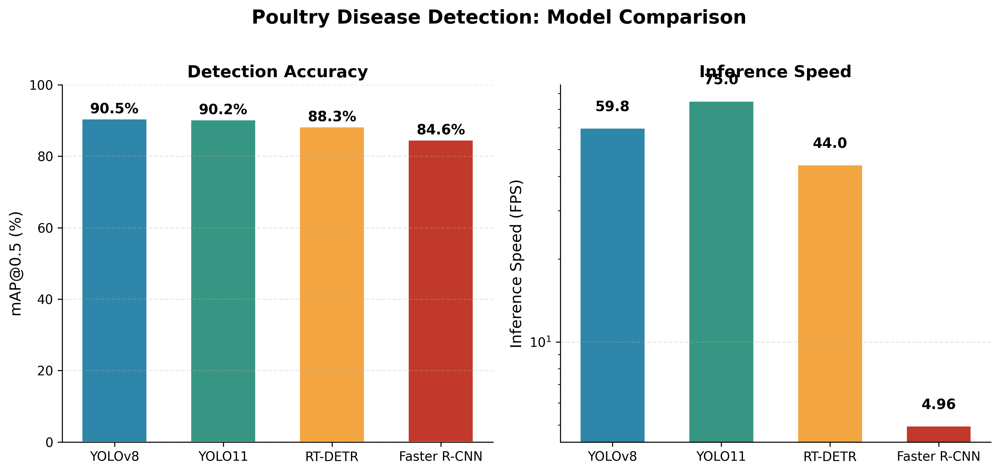
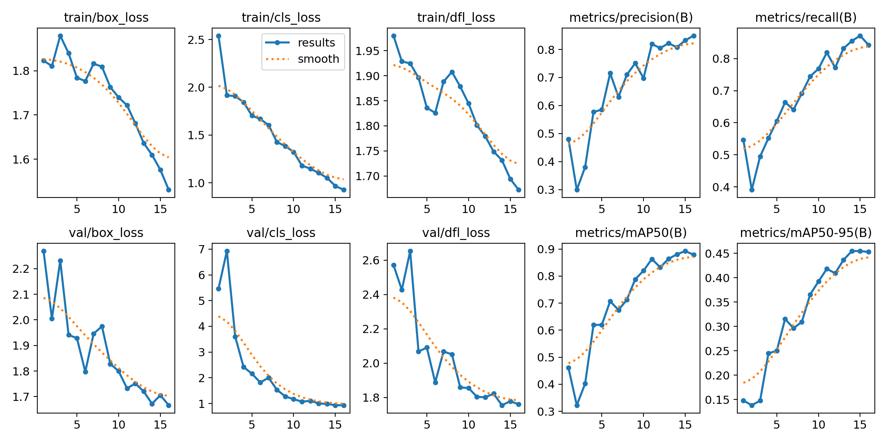
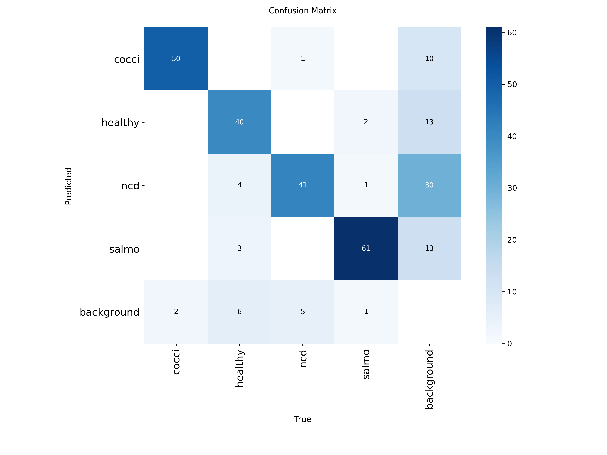
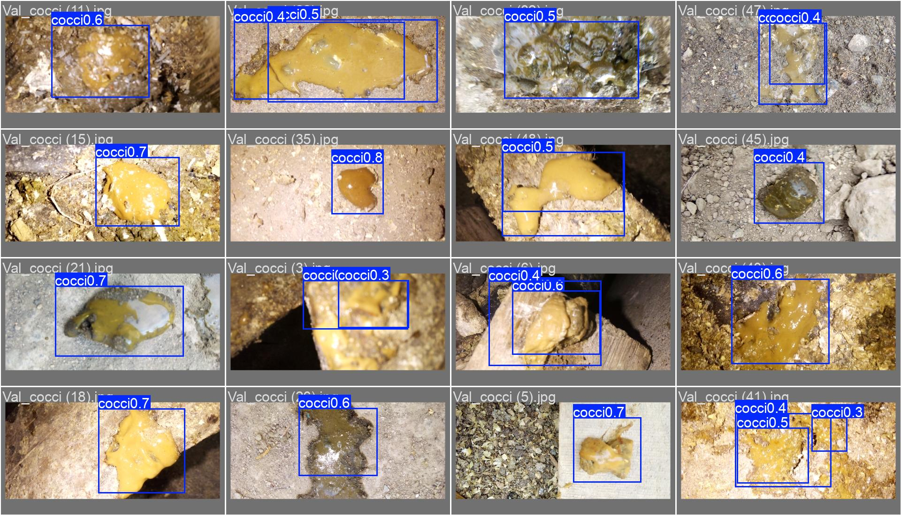
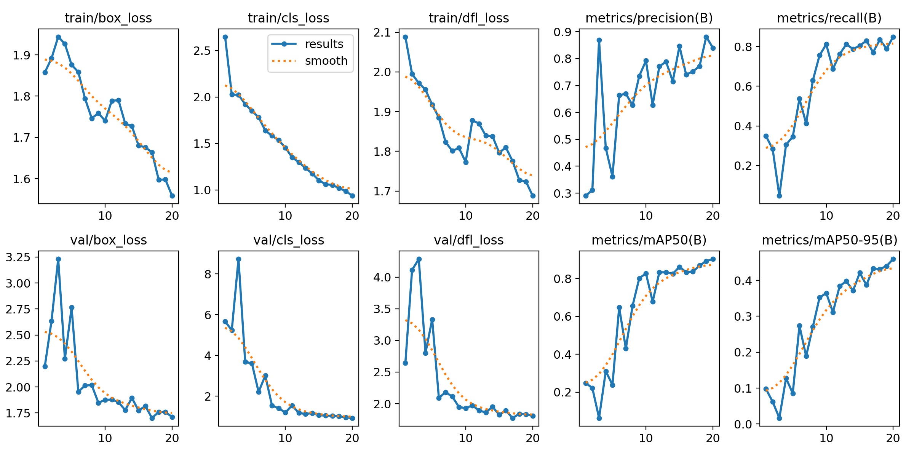
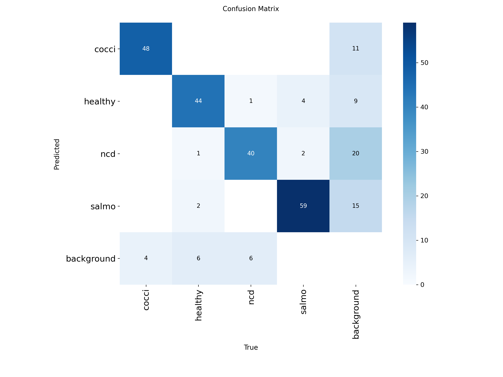
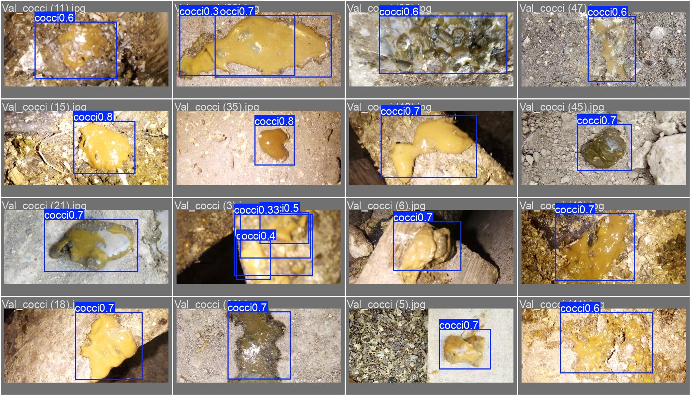
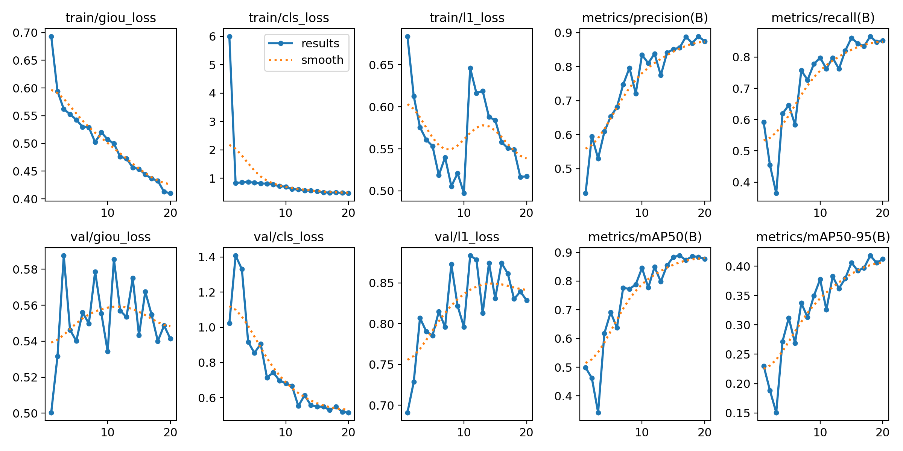
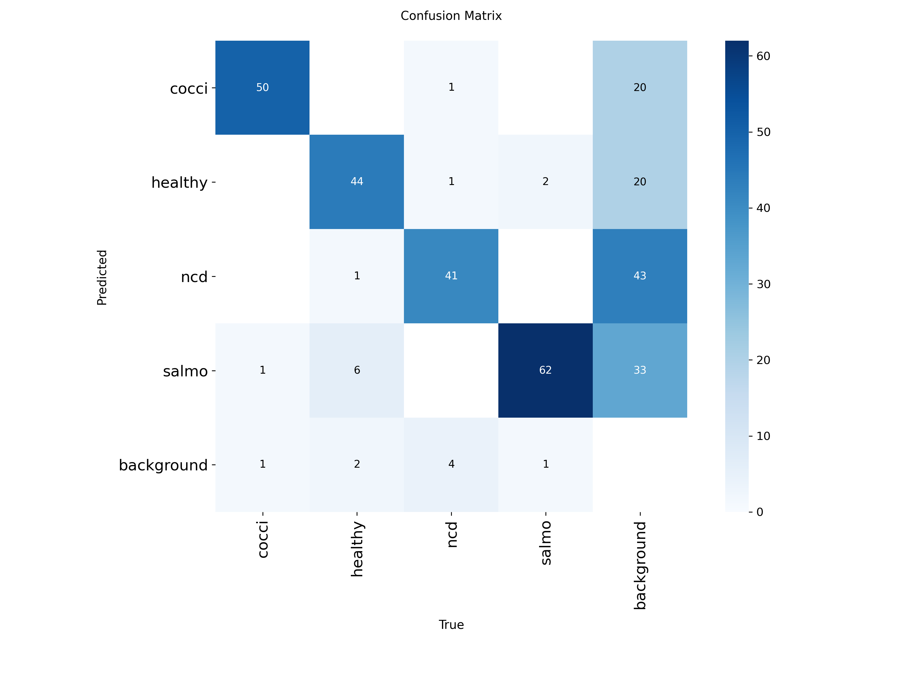
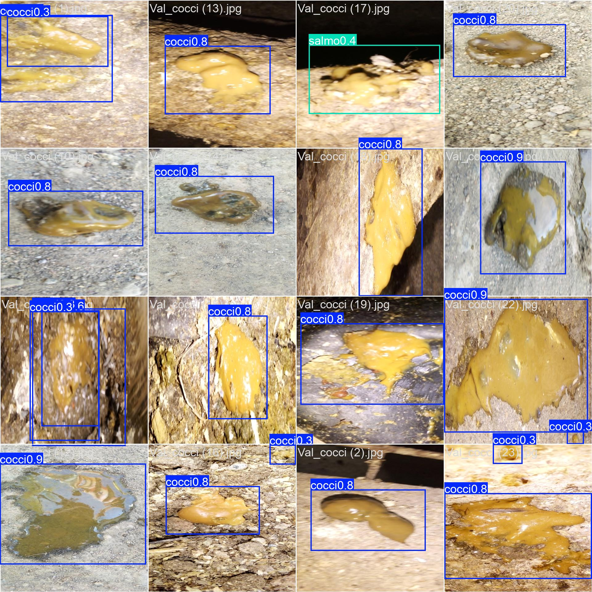

# Poultry Disease Detection: A Comparative Study of Object Detection Models

> 🚧 **Work in progress.** Manuscript in preparation for submission to **ICCIT 2026** (IEEE-sponsored). Final polished results, code cleanup, and journal extension will follow.

A comparative evaluation of four object detection architectures — **YOLOv8**, **YOLO11**, **RT-DETR**, and **Faster R-CNN** — for automated detection of poultry diseases from images, aimed at supporting low-cost, real-time disease screening in poultry farms.

## Problem

Poultry diseases such as coccidiosis, Newcastle disease (NCD), and salmonellosis cause major economic losses in the poultry industry, especially where manual veterinary diagnosis is slow or inaccessible. This project benchmarks modern object detection models to identify which architecture best balances **accuracy** and **real-time inference speed** for this task.

## Dataset

- **Source:** Public Kaggle poultry disease image dataset
- **Size:** 2,000 images
- **Classes (4):** `coccidiosis`, `healthy`, `ncd`, `salmonellosis`
- **Annotation format:** YOLO format (bounding boxes)

## Models Compared

| Model | Type | Backbone / Notes |
|---|---|---|
| YOLOv8 | One-stage, anchor-free | Ultralytics |
| YOLO11 | One-stage, anchor-free | Ultralytics |
| RT-DETR | Transformer-based, real-time | Ultralytics |
| Faster R-CNN | Two-stage | ResNet50-FPN backbone |

## Results

| Model | mAP@0.5 | Inference Speed (FPS) |
|---|---|---|
| **YOLOv8** | **90.5%** | **59.8** |
| YOLO11 | 90.2% | ~75 |
| RT-DETR | 88.3% | ~44 |
| Faster R-CNN | 84.6% | ~5 |

*Faster R-CNN accuracy evaluated with `torchmetrics` (COCO-style mAP) for methodological consistency with the Ultralytics-based models.*



**Key finding:** YOLOv8 and YOLO11 achieve nearly identical top accuracy (90.5% and 90.2% mAP@0.5), but **YOLO11 is notably faster** (~75 FPS vs. 59.8 FPS), making it the better accuracy–speed trade-off for real-time deployment. RT-DETR trails slightly in both accuracy and speed. Faster R-CNN achieves competitive accuracy but is roughly 12× slower than YOLO11, reflecting the classic one-stage vs. two-stage detector trade-off. Notably, **YOLO11 outperformed YOLOv8 specifically on the NCD class**, suggesting it may generalize better on harder-to-distinguish disease patterns.

### Per-model diagnostics

<details>
<summary>YOLOv8</summary>




</details>

<details>
<summary>YOLO11</summary>




</details>

<details>
<summary>RT-DETR</summary>




</details>

<details>
<summary>Faster R-CNN</summary>


</details>


## Repository Structure

```
.
├── NoteBooks/
│   ├── YOLOv8_Training.ipynb          # YOLOv8 training & evaluation
│   ├── YOLO11_RTDETR_Training.ipynb   # YOLO11 + RT-DETR training & evaluation
│   └── FasterRCNN_Training.ipynb      # Faster R-CNN training & evaluation
├── YOLO_8/                        # results.png, confusion_matrix.png, etc.
├── YOLO_11/                       # results.png, confusion_matrix.png, etc.
├── rtdetr/                        # results.png, confusion_matrix.png, etc.
├── Faster_RCNN/                   # confusion_matrix.png
├── model_comparison.png           # 4-model comparison chart
└── README.md
```

> **Note:** The YOLOv8 notebook includes several training attempts with different epoch/batch configurations while tuning hyperparameters; the final reported results come from the best-performing run.

## Setup / Reproduce

All models were trained and evaluated in **Google Colab** with a Tesla T4 GPU.

1. Open the relevant notebook in Colab
2. Mount Google Drive and point to the dataset path
3. Run all cells — training, evaluation, and metric computation are included end-to-end

**Key dependencies:** `ultralytics`, `torch`, `torchvision`, `torchmetrics`

## Training Configuration

- **Faster R-CNN:** ResNet50-FPN backbone, SGD optimizer, StepLR scheduler, batch size 4, 20 epochs
- **YOLOv8 / YOLO11 / RT-DETR:** Ultralytics default training recipe, fine-tuned on the poultry dataset

## Publication

This work is being prepared for submission to **ICCIT 2026** (IEEE-sponsored), with a planned journal extension afterward (targeting *MDPI Agriculture* or *IEEE Access*).

## Author

**Siam** — B.Sc. in Computer Science and Engineering, Daffodil International University
[GitHub](https://github.com/khansaheb587) · [Email](#)

## License

MIT License — see [LICENSE](LICENSE) for details.
